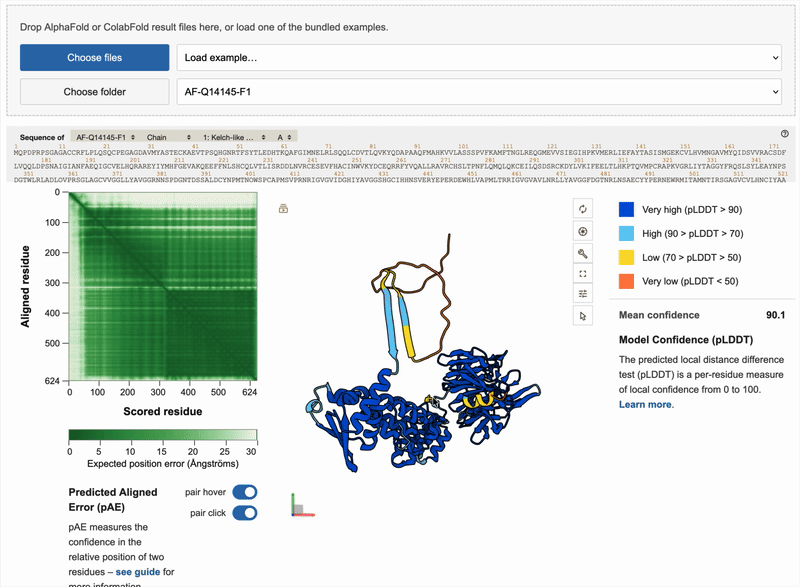

# AFDB-style Mol* Viewer

Prototype local-first and mostly vibe-coded web app for inspecting self-generated 
protein structure predictions just like in the AlphaFold database.

uses PDBe Mol*, adds an AlphaFold DB-style interactively linked pAE workspace.



## Features

- load local prediction files directly in the browser
- PDBe Mol* viewer with light UI and AFDB-like illustrative cartoon rendering
- native Mol* sequence panel with pLDDT coloring
- linked pAE heatmap, sequence, and 3D structure interactions
- some content-based pairing of structure and JSON files, even when filenames do not match
- when folder import is ambiguous or missing, resolver gives clear errors
- structure-only loading for lone `.pdb` / `.cif` files that already contain pLDDTs
- if no real pAE is present, the app uses a placeholder pAE matrix
- examples included

## supported Inputs

The app currently understands:

- AlphaFold DB / AF2:
  - structure `.pdb`, `.cif`, or `.mmcif`
  - `predicted_aligned_error` JSON
- ColabFold:
  - structure `.pdb`
  - scores JSON with `plddt`, optional `pae`, `ptm`, and `iptm`
- Structure-only:
  - a lone `.pdb` / `.cif` / `.mmcif` with confidence values embedded in the structure

## setup

get `npm` by installing [Node.js](https://nodejs.org/en/download) on your platform.  

install dependencies and run the (dev) server:

```bash
npm install
npm run dev
```


production build:
```bash
npm run build
# run tests
npm test
# preview locally
npm run preview
```

## Future plans
- This will become a part of the Web UI for a larger project around BindCraft.
- There will be a FastAPI server that manages SLURM jobs for BindCraft and ColabFold, and maybe does some light-weight pre- or post-processing and orchestration.
- The Web UI should gain functionality to:
  - display the structure of the target protein / template pair
  - enable selecting the interface, i.e. binding hotspots
  - enable cropping that protein
  - show the generated binders
  - show the AF2-predicted structures of the binders
  - allow comparing the binders, maybe in separate connected views or with overlaying
  - enable saving/exporting views from viewer panels as Mol* states

## Attribution
Reverse-engineered from the [AlphaFold database](https://alphafold.com/), 
which is under a [CC-BY-4.0](https://creativecommons.org/licenses/by/4.0/) 
creative commons license and developed by [Google DeepMind](https://deepmind.google/) 
with [EMBL-EBI](https://www.ebi.ac.uk/).